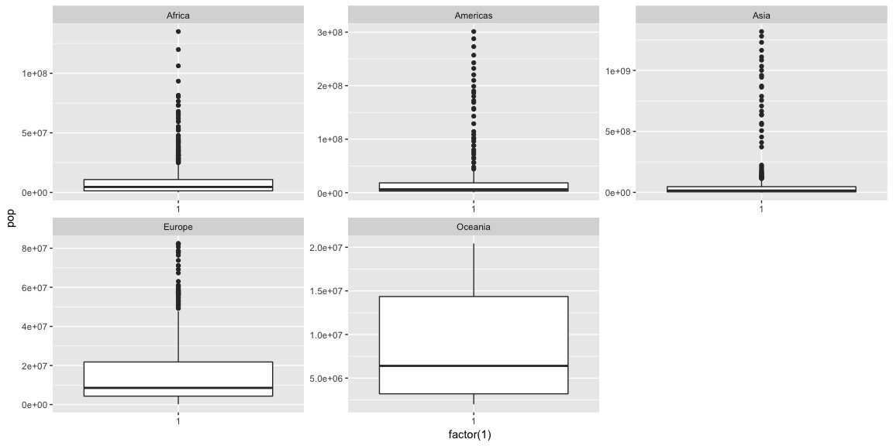
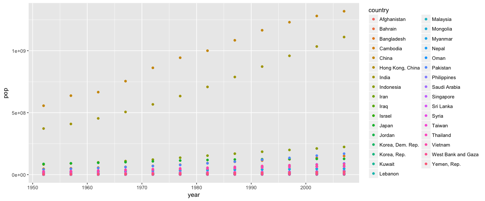

Gapminder Exploration
================

Get the Gapminder data
----------------------

Work with some of the data from the [Gapminder project](http://www.gapminder.org). Since the package is already installed, we just need to load it, also load the package that are useful for analyzing the data.

``` r
library(gapminder)
library(tidyverse)
```

    ## Loading tidyverse: ggplot2
    ## Loading tidyverse: tibble
    ## Loading tidyverse: tidyr
    ## Loading tidyverse: readr
    ## Loading tidyverse: purrr
    ## Loading tidyverse: dplyr

    ## Conflicts with tidy packages ----------------------------------------------

    ## filter(): dplyr, stats
    ## lag():    dplyr, stats

``` r
library(ggplot2)
```

Have a look at the data:

``` r
glimpse(gapminder)
```

    ## Observations: 1,704
    ## Variables: 6
    ## $ country   <fctr> Afghanistan, Afghanistan, Afghanistan, Afghanistan,...
    ## $ continent <fctr> Asia, Asia, Asia, Asia, Asia, Asia, Asia, Asia, Asi...
    ## $ year      <int> 1952, 1957, 1962, 1967, 1972, 1977, 1982, 1987, 1992...
    ## $ lifeExp   <dbl> 28.801, 30.332, 31.997, 34.020, 36.088, 38.438, 39.8...
    ## $ pop       <int> 8425333, 9240934, 10267083, 11537966, 13079460, 1488...
    ## $ gdpPercap <dbl> 779.4453, 820.8530, 853.1007, 836.1971, 739.9811, 78...

``` r
dim(gapminder)
```

    ## [1] 1704    6

Explore the variable *"pop"*

``` r
min(gapminder$pop)
```

    ## [1] 60011

``` r
max(gapminder$pop)
```

    ## [1] 1318683096

``` r
ggplot(gapminder, aes(y = pop)) + geom_boxplot(aes(x = factor(1))) +  facet_wrap(~continent, scales = "free")
```



Because gapminder has too much info, in my work, I just extract the data that belong to the continent of Asia, and variables *"country"*, *"year"*, and *"pop"*.

``` r
gDat <- gapminder[gapminder$continent == "Asia", c("country", "year", "pop")]
str(gDat)
```

    ## Classes 'tbl_df', 'tbl' and 'data.frame':    396 obs. of  3 variables:
    ##  $ country: Factor w/ 142 levels "Afghanistan",..: 1 1 1 1 1 1 1 1 1 1 ...
    ##  $ year   : int  1952 1957 1962 1967 1972 1977 1982 1987 1992 1997 ...
    ##  $ pop    : int  8425333 9240934 10267083 11537966 13079460 14880372 12881816 13867957 16317921 22227415 ...

Plot annual population for different countries in Asia

``` r
ggplot(gDat, aes(x = year, y = pop)) + geom_point(aes(color = country)) 
```



R Markdown
----------

This is an R Markdown document. Markdown is a simple formatting syntax for authoring HTML, PDF, and MS Word documents. For more details on using R Markdown see <http://rmarkdown.rstudio.com>.

When you click the **Knit** button a document will be generated that includes both content as well as the output of any embedded R code chunks within the document. You can embed an R code chunk like this:

``` r
summary(cars)
```

    ##      speed           dist       
    ##  Min.   : 4.0   Min.   :  2.00  
    ##  1st Qu.:12.0   1st Qu.: 26.00  
    ##  Median :15.0   Median : 36.00  
    ##  Mean   :15.4   Mean   : 42.98  
    ##  3rd Qu.:19.0   3rd Qu.: 56.00  
    ##  Max.   :25.0   Max.   :120.00

Including Plots
---------------

You can also embed plots, for example:


Note that the `echo = FALSE` parameter was added to the code chunk to prevent printing of the R code that generated the plot.
